## 📖 Project Overview

This project demonstrates the implementation of a production-style AWS Three-Tier Web Architecture following AWS best practices.

The architecture is divided into three logical layers:

- 🌐 Web Tier
- ⚙️ Application Tier
- 🗄️ Database Tier

Resources are deployed across multiple Availability Zones to provide high availability, security, and scalability.

---

# 🏗️ Architecture Diagram

<p align="center">
  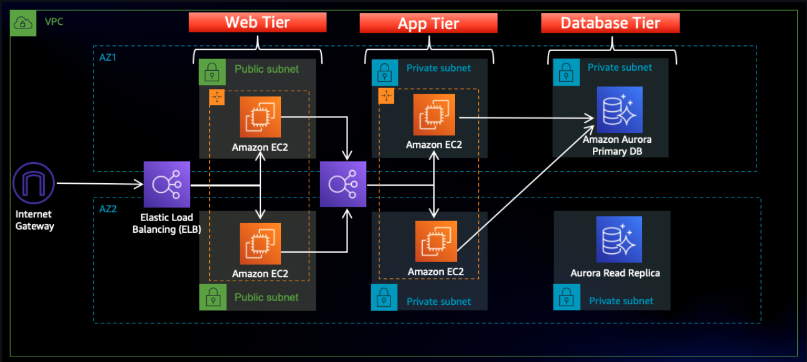
</p>

---

# ☁️ AWS Services Used

- Amazon VPC
- Amazon EC2
- Amazon RDS MySQL
- Application Load Balancer (ALB)
- Target Groups
- Internet Gateway
- NAT Gateway
- Route Tables
- Public & Private Subnets
- Security Groups
- IAM
- Amazon S3

---

# 🏛️ Architecture Components

## 1️⃣ Amazon VPC

Created a custom Virtual Private Cloud (VPC) to isolate all AWS resources.

<p align="center">
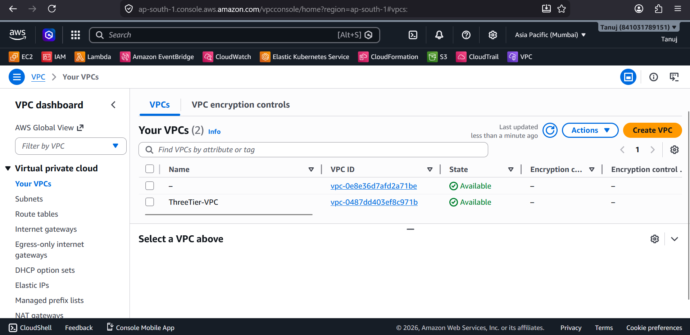
</p>

---

## 2️⃣ Public & Private Subnets

Configured public subnets for the Web Tier and private subnets for the Application and Database tiers.

<p align="center">
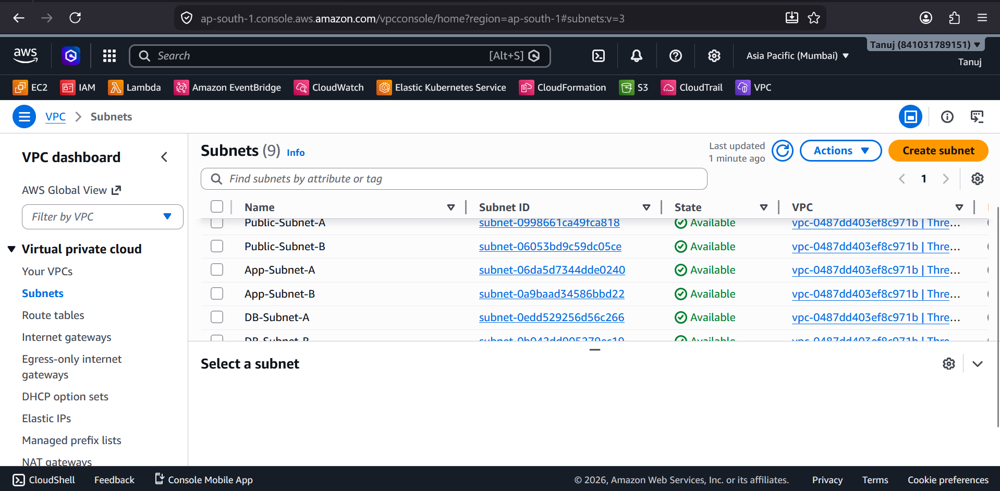
</p>

---

## 3️⃣ Internet Gateway

Attached an Internet Gateway to the VPC to allow internet access for public resources.

<p align="center">
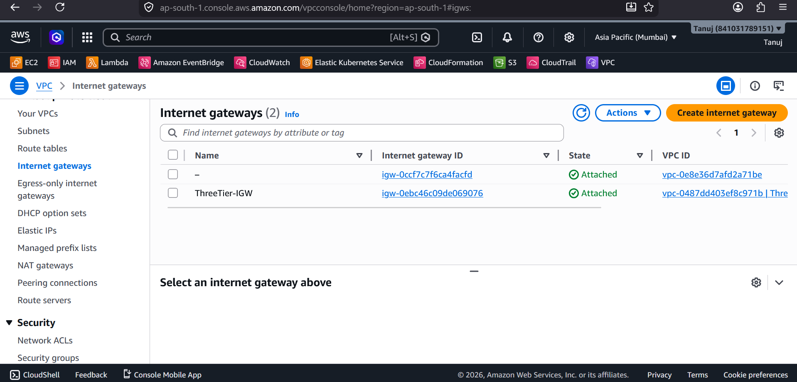
</p>

---

## 4️⃣ NAT Gateway

Configured a NAT Gateway to provide secure outbound internet access for private subnet resources.

<p align="center">
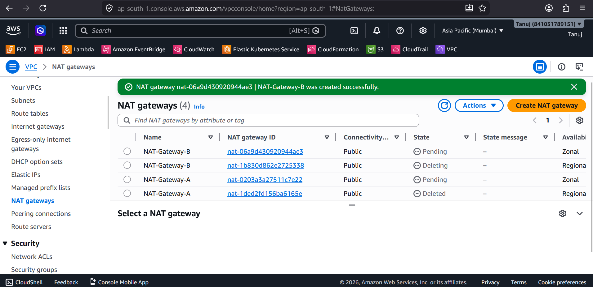
</p>

---

## 5️⃣ Application Load Balancer

Configured an Application Load Balancer to distribute incoming traffic across multiple EC2 instances.

<p align="center">
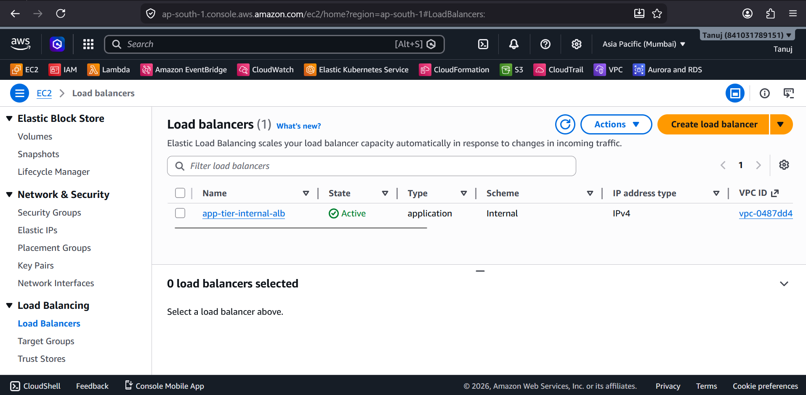
</p>

---

## 6️⃣ Target Group

Created a Target Group to route traffic from the Load Balancer to healthy EC2 instances.

<p align="center">
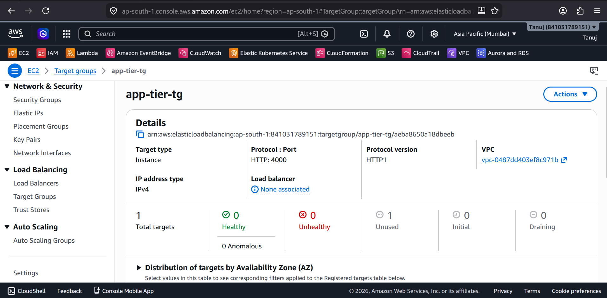
</p>

---

## 7️⃣ Security Groups

Configured Security Groups to securely control inbound and outbound traffic between the Web, Application, and Database tiers.

<p align="center">

</p>

---

## 8️⃣ IAM

Created IAM users and roles following the principle of least privilege to securely manage AWS resources.

<p align="center">
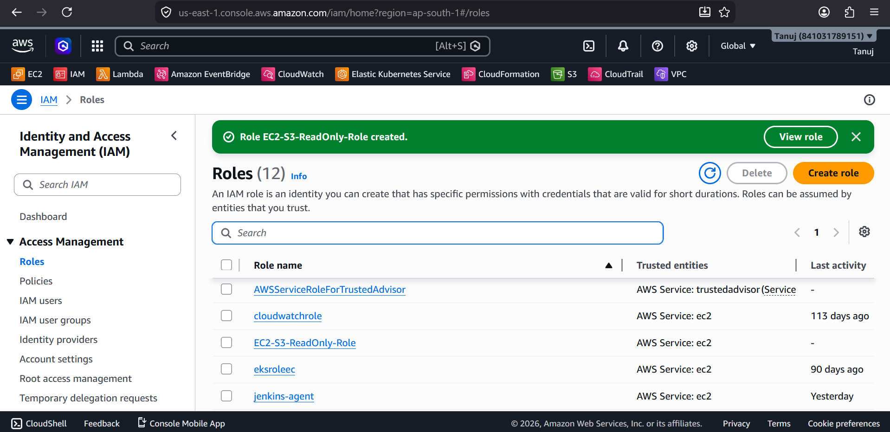
</p>

---

## 9️⃣ Amazon S3

Used Amazon S3 for object storage and application-related assets.

<p align="center">
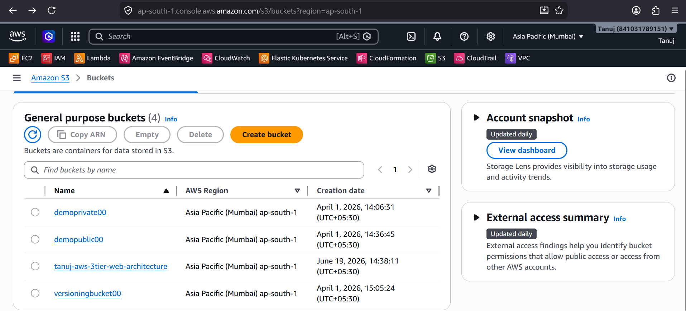
</p>

---

## 🔟 Database (Amazon RDS MySQL)

Deployed Amazon RDS MySQL inside private subnets for secure database connectivity.

<p align="center">
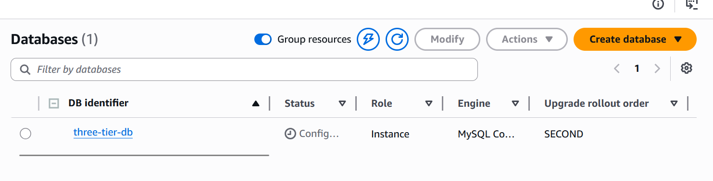
</p>

---

## 1️⃣1️⃣ MySQL Database

Configured MySQL database for the backend application.

<p align="center">
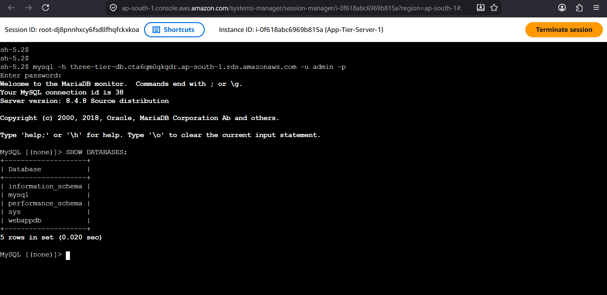
</p>

---

# 🔐 Security Features

- Private Database Tier
- Public and Private Subnet Isolation
- Security Groups
- IAM Access Control
- Internet Gateway
- NAT Gateway
- Load Balancer Health Checks

---

# 🚀 Deployment Steps

1. Create a custom Amazon VPC.
2. Create Public and Private Subnets.
3. Configure Route Tables.
4. Attach an Internet Gateway.
5. Create a NAT Gateway.
6. Configure Security Groups.
7. Launch EC2 instances.
8. Configure the Application Load Balancer.
9. Create Target Groups.
10. Deploy the web application.
11. Create an Amazon RDS MySQL database.
12. Connect the application to the database.
13. Verify application accessibility through the Load Balancer.

---

# 📁 Project Structure

```text
aws-3tier-web-architecture/
│
├── images/
│   ├── architecture.png
│   ├── aws-security.png
│   ├── database.png
│   ├── db.png
│   ├── IAM.png
│   ├── internet-gateway.png
│   ├── load-balancer.png
│   ├── Mysql.png
│   ├── nat-gateway.png
│   ├── s3-bucket.png
│   ├── subnets.png
│   ├── target-group.png
│   ├── vpc.png
│   └── website.png
│
└── README.md
```

---

# ✅ Application Output

<p align="center">
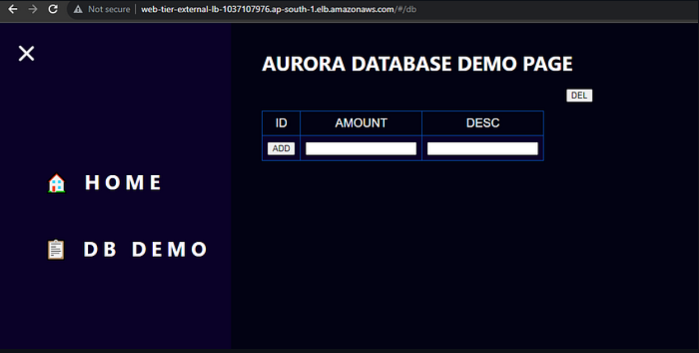
</p>

---

# 🎯 Future Improvements

- Auto Scaling Groups
- HTTPS using AWS Certificate Manager
- Route 53 Domain Integration
- AWS WAF
- CloudWatch Monitoring
- AWS Secrets Manager
- Terraform Automation
- GitHub Actions CI/CD Pipeline

---

# 📚 Learning Outcomes

Through this project, I gained hands-on experience with:

- AWS Networking
- Amazon VPC
- EC2 Deployment
- Application Load Balancer
- Target Groups
- Amazon RDS MySQL
- IAM
- Security Groups
- High Availability Architecture
- AWS Best Practices

---

# 👨‍💻 Author

**Tanuj Nimkar**

GitHub: https://github.com/TanUjNimkar

Repository: https://github.com/TanUjNimkar/aws-3tier-web-architecture

---

## ⭐ If you found this project useful, consider giving it a star on GitHub!

